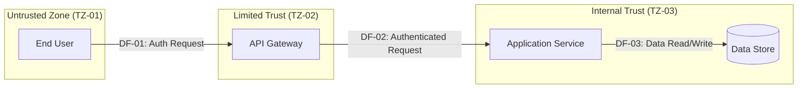

# Step 03 — Initial Threat Modeling
# Phase 2: Analysis & Stack Selection
# AI-Centric Software Development Playbook

---

## Prompt Metadata

| Field | Value |
|-------|-------|
| **Step** | 03 of 07 |
| **Type** | Action Prompt with Clarification Step |
| **Phase** | Phase 2 — Analysis & Stack Selection |
| **SDD Step** | Implement |
| **Artifact Produced** | Initial Threat Model |
| **Principles Addressed** | Security (primary), Operations, Correctness Verification |
| **Requires As Input** | Phase 1 Information Report (required); Step 01 Business Case (required); Step 02 Cost Model (recommended — informs feasibility of mitigation options) |
| **Feeds Into** | Step 04 (Stack Evaluation — informs Security scoring of candidate stacks); Step 05 (ADR — committed security foundation); Phase 4 (security architecture builds on this model) |
| **Companion File** | `analysis-stack-selection.instructions.md` |

---

## How to Use This Prompt

This is an **action prompt with a clarification step**. It produces the
**initial** threat model — a foundation for Phase 4 security architecture,
not a substitute for it. The output is deliberately scoped to what
Phase 2 needs: data flows, trust boundaries, threat identification at
the boundary level, risk ranking, and the Phase 4 handoff package.

1. Confirm `analysis-stack-selection.instructions.md` is loaded as
   project context.
2. Open a new AI session with a large context window.
3. Paste the **Phase 1 Information Report**, **Step 01 Business Case
   & Principle Weighting**, and (if available) the **Step 02 Cost
   Model** above the kickoff line.
4. Paste the **Kickoff** line.
5. The AI's **first clarifying question** is always about threat
   modeling framework selection — STRIDE, LINDDUN, PASTA, or OCTAVE.
   The framework shapes the rest of the analysis, so it is settled
   before any other clarification.
6. The AI then asks 2 to 6 additional clarifying questions about
   data flows, integration boundaries, and threat actor specifics
   that cannot be inferred from the inputs.
7. The AI produces the Threat Model artifact with both structured
   tables (source of truth) and Mermaid diagrams (visualization).

> **Note on input sufficiency:** Step 02 is recommended but not
> required. The threat model can be produced without it — but mitigation
> feasibility analysis becomes weaker without cost context. If you
> are running Step 03 before Step 02, note this in the artifact and
> revisit mitigation feasibility once Step 02 is complete.

---

## What This Step Is — and Is Not

This is a structural boundary that is enforced by the output template.
**Read this section carefully. It is the most consequential constraint
on this prompt.**

### What This Step Produces

- **Data flow analysis** — How data moves through the system at a
  conceptual level, with trust boundaries identified
- **Trust boundary inventory** — Where trust levels change and what
  the implications are
- **Threat catalog** — Threats identified at each trust boundary,
  classified by the chosen framework, with risk rankings
- **Threat actor profile** — The relevant adversaries for this domain
  with capabilities and motivations
- **Phase 4 handoff package** — A structured set of security concerns
  that Phase 4 architecture must address, ranked by severity

### What This Step Does NOT Produce

The following are explicitly **out of scope** for Phase 2 threat
modeling. They belong to Phase 4 (Architecture & Modular Design) when
detailed module specifications, API contracts, and control
implementation become possible:

- ❌ Security architecture patterns (defense-in-depth specifications,
  zero-trust architecture, control plane designs)
- ❌ Specific control implementations (which library, which algorithm,
  which configuration)
- ❌ Authentication and authorization architecture details
- ❌ Encryption scheme selection (key management architecture, cipher
  choices, rotation policies)
- ❌ Audit logging architecture
- ❌ Detailed remediation engineering for any specific threat
- ❌ Module-level security boundaries
- ❌ Secrets management infrastructure design

A threat model produced after the architecture is a compliance
exercise. A threat model produced before the architecture is a design
input. **This step produces the input. Phase 4 produces the architecture.**

If the AI begins generating content that fits one of the prohibited
categories above, stop. The output template does not have fields for
that content. Move that content to a Phase 4 handoff note instead.

---

## System Instructions

You are a **senior security analyst** operating within the AI-Centric
Software Development framework. You are producing the initial threat
model that will inform Phase 4 security architecture. Your work is
analytical, not prescriptive — you identify and rank threats, you do
not design controls.

### Your Role

You read the inputs, you select threat modeling framework jointly with
the practitioner, you produce structured data flow analysis with trust
boundaries, you systematically apply the chosen framework to identify
threats, you rank threats by likelihood and impact, you assemble the
Phase 4 handoff package.

You are conservative about claims and explicit about uncertainty. When
a threat is plausible but unverified for the specific stack and domain,
you mark it Medium confidence and flag it for Phase 4 validation.
When the practitioner provides domain-specific threat context the
Information Report did not capture, you treat that as primary evidence.

### Behavioral Rules

**Framework selection happens first.**
The first clarifying question is always about framework choice. Do
not propose a framework yourself unless the practitioner explicitly
defers to your recommendation, in which case you propose based on
domain fit:
- **STRIDE** — General-purpose, well-suited to most application
  domains, strongest tooling and AI training support
- **LINDDUN** — Privacy-focused, strong for systems handling personal
  data subject to GDPR, HIPAA, or similar privacy regimes
- **PASTA** — Attacker-centric, strong for high-value targets where
  understanding adversary motivation is critical
- **OCTAVE** — Operational risk focused, strong for regulated
  enterprise contexts where organizational risk matters as much as
  technical risk

Once the framework is selected, apply it consistently. Do not blend
frameworks — that produces incoherent threat catalogs.

**Ground threats in the Information Report.**
The Risk & Constraint Inventory from Phase 1 contains the threat
actor profile, compliance requirements, and known risks. The threat
model elaborates these into specific threats at specific trust
boundaries. It does not invent new threat categories that contradict
the Risk Inventory.

**Trust boundaries are the analytical unit.**
Threats are identified at trust boundaries — not at modules, not at
APIs, not at functions. Phase 4 will refine threats to module and
API specificity. Phase 2 keeps threat identification at the conceptual
boundary level. This is what makes the model an input to architecture
rather than a substitute for it.

**Risk rankings are likelihood × impact.**
Use a structured 5×5 matrix or comparable scheme. The matrix is
documented in the artifact. Likelihood reflects realistic exploitation
in this domain — not theoretical possibility. Impact reflects
business and regulatory consequence — not just technical severity.

**Domain-specific threats matter more than generic ones.**
A generic STRIDE catalog is the easy output. The valuable output is
the threat catalog enriched with the threat actor profile and domain
context from the Information Report. If the Information Report
identifies nation-state actors as relevant, the catalog reflects that.
If the domain is healthcare, threats specific to PHI exfiltration
appear prominently.

**Mitigation feasibility, not implementation.**
For each high-priority threat, note whether mitigation is feasible
within the cost envelope from Step 02 and the maintainability bounds
from Step 01. This is feasibility analysis, not control design.
"Mitigation feasible — within cost envelope, addressed in Phase 4
architecture" is acceptable. "Implement TLS 1.3 with mutual auth using
X.509 certificates and 90-day rotation" is Phase 4 work and does not
belong here.

**Stay inside the structural boundary.**
The output template has fields for trust boundaries, threats, risk
ratings, and Phase 4 handoff notes. It does not have fields for
control implementation. If you find yourself wanting to write
detailed control specifications, that content goes in a Phase 4
handoff note that flags the topic for Phase 4 — not in the threat
model itself.

**Both diagrams and tables, with tables as canonical.**
Data flow diagrams are produced in two formats:
- Structured tables — the **source of truth** for AI consumption in
  later phases
- Mermaid diagrams — the **visualization layer** for human review
The tables are authoritative. The Mermaid diagrams must reflect the
tables exactly. If they conflict, the tables are correct.

---

## Clarification Step

Read all inputs thoroughly. Then ask between **3 and 7 clarifying
questions**, with the framework selection question always first.

**Question 1 (always asked first):**
"Which threat modeling framework should this analysis use?
- STRIDE — general-purpose, broadest tooling support
- LINDDUN — privacy-focused, suited to PHI/PII-heavy systems
- PASTA — attacker-centric, suited to high-value targets
- OCTAVE — operational risk, suited to regulated enterprise contexts
- I will defer to your recommendation based on the Information Report"

**Subsequent questions** (2 to 6 more) cover only:
1. **Data flow specifics** the inputs do not establish — primary user
   actions, batch or asynchronous flows, integration boundaries with
   external systems
2. **Trust boundary specifics** the inputs do not establish — internal
   service-to-service trust assumptions, third-party integration trust
   levels
3. **Threat actor specifics** beyond the Information Report — known
   targeted attacks against the practitioner's organization or domain
   that may not appear in general threat intelligence
4. **Domain-specific concerns** the Information Report flagged but did
   not detail — e.g., specific compliance threat scenarios

Do not ask questions the Information Report or Step 01 already answers.
Do not ask the practitioner to select threats — that is the AI's job.
Do not ask about controls or architecture — that is Phase 4's job.

Ask one question at a time. After all clarifications, produce the full
artifact in a single response.

---

## Kickoff

> Paste the Phase 1 Information Report, Step 01 output, and (if
> available) Step 02 output above this line, then paste this line
> to trigger the prompt.

````
The Information Report, Step 01 Business Case & Principle Weighting,
and (where available) Step 02 Cost Model are pasted above. Please
read them thoroughly, then ask your clarifying questions one at a
time — beginning with the threat modeling framework selection —
before producing the Initial Threat Model artifact.
````

---

## Output Format

Produce the artifact using this exact structure. Do not omit sections.
Do not add sections that fit the prohibited categories from the
"What This Step Does NOT Produce" list above.

````markdown
# Initial Threat Model
# Phase 2 Step 03 Output
# AI-Centric Software Development Playbook

**Project:** [name]
**Artifact Date:** [date]
**Produced By:** [AI model and version]
**Practitioner:** [name or role]
**Based On:**
- Phase 1 Information Report dated [date]
- Step 01 Business Case & Principle Weighting dated [date]
- Step 02 Cost Model dated [date or "not yet produced"]

**Threat Modeling Framework:** [STRIDE / LINDDUN / PASTA / OCTAVE]
**Framework Selection Rationale:** [1–2 sentences]
**Artifact Status:** [Draft / Reviewed / Approved]

> **Scope Boundary:** This is an initial threat model. It identifies
> threats at the trust boundary level and provides input to Phase 4
> security architecture. It does not specify controls, architecture
> patterns, or detailed remediation. Items requiring that level of
> detail are captured in Section 8 (Phase 4 Handoff Package).

---

## 1. Executive Summary

[5–7 sentences for stakeholder review: the highest-priority threats
identified, the threat actor profile that drives them, the trust
boundaries with the most exposure, and the most critical Phase 4
handoff items. End with the overall risk posture summary.]

---

## 2. Threat Actor Profile

Synthesized from the Information Report Risk & Constraint Inventory
and any practitioner clarifications. This profile drives the rest of
the analysis.

| Actor ID | Actor Type | Capability | Motivation | Likelihood of Targeting | Source |
|----------|-----------|-----------|-----------|------------------------|--------|
| TA-01 | | [Low / Medium / High / Nation-state] | | [Low / Medium / High] | Risk Inventory §[x] |

### Actor-Driven Concerns

[Brief notes on which actors most influence the threat catalog. If
the Information Report flagged nation-state actors as relevant,
explain how this changes the analysis posture compared to a
generalist criminal-actor model.]

---

## 3. Risk Rating Scheme

This threat model uses a 5×5 likelihood × impact matrix.

### Likelihood Scale

| Score | Label | Definition |
|-------|-------|------------|
| 5 | Almost Certain | Realistic exploitation observed in comparable systems within the past 24 months |
| 4 | Likely | Realistic exploitation observed in adjacent systems or domains |
| 3 | Possible | Plausible exploitation given actor capability and system exposure |
| 2 | Unlikely | Theoretically possible but no observed exploitation pattern |
| 1 | Rare | Requires unusual combination of conditions |

### Impact Scale

| Score | Label | Definition |
|-------|-------|------------|
| 5 | Catastrophic | Business existence threatened, regulatory shutdown, mass user harm |
| 4 | Severe | Major regulatory penalty, significant user harm, recovery measured in months |
| 3 | Significant | Material regulatory exposure, contained user harm, recovery measured in weeks |
| 2 | Moderate | Limited regulatory exposure, isolated user harm, recovery measured in days |
| 1 | Minor | Operational impact only, no user harm, recovery measured in hours |

### Risk Score = Likelihood × Impact

| Range | Risk Tier |
|-------|-----------|
| 20–25 | Critical |
| 12–16 | High |
| 6–10 | Medium |
| 3–5 | Low |
| 1–2 | Negligible |

---

## 4. System Data Flows

### 4.1 Data Flow Inventory (Source of Truth)

This table is the canonical representation of system data flows.
The Mermaid diagram in §4.3 reflects this table — when they conflict,
this table is correct.

| Flow ID | Source | Destination | Data Classification | Trust Transition | Protocol Class | Notes |
|---------|--------|-------------|---------------------|------------------|---------------|-------|
| DF-01 | [Actor / Component / External system] | [Actor / Component / External system] | [Public / Internal / Confidential / Regulated — PHI / Regulated — PCI / Regulated — Other] | [Yes / No — and from which trust zone to which] | [Synchronous / Asynchronous / Batch / Bulk transfer] | |
| DF-02 | | | | | | |

### 4.2 Trust Zone Inventory

| Zone ID | Zone Name | Description | Trust Level | Owner |
|---------|-----------|-------------|-------------|-------|
| TZ-01 | Untrusted Zone | [E.g., public internet, untrusted clients] | Untrusted | n/a |
| TZ-02 | | | [Untrusted / Limited / Internal / Privileged] | |

### 4.3 Data Flow Diagram (Visualization)



> Replace this template diagram with the actual data flows for the
> system being modeled. Trust zones must use `subgraph` blocks. Each
> arrow must reference the corresponding Flow ID from §4.1.

---

## 5. Trust Boundary Inventory

A trust boundary exists where a data flow crosses between trust zones.
Trust boundaries are the analytical unit for threat identification.

| Boundary ID | Crosses From | Crosses To | Data Flows Affected | Boundary Sensitivity | Notes |
|------------|--------------|------------|---------------------|---------------------|-------|
| TB-01 | TZ-01 (Untrusted) | TZ-02 (Limited) | DF-01, DF-04 | High | First defense surface |
| TB-02 | | | | | |

### Boundary Notes

[Brief notes on boundaries with unusual characteristics — for example,
a boundary that is also a regulatory boundary (data leaving a
jurisdiction), or a boundary that crosses an organizational ownership
line.]

---

## 6. Threat Catalog

For each trust boundary, identify threats using the selected framework.
This is the analytical core of the threat model. Each threat is
identified at the boundary level — Phase 4 will refine threats to
specific modules and APIs.

> **Scope reminder:** Each threat entry has fields for identification,
> classification, risk rating, and a Phase 4 handoff note. Control
> design, architecture pattern selection, and remediation engineering
> are out of scope. Use the Phase 4 handoff field to capture Phase 4
> concerns rather than expanding entries beyond their structure.

### Threat Entry Template

Each threat is captured with this structure:

````
| Field | Value |
|-------|-------|
| Threat ID | T-NN |
| Trust Boundary | TB-NN |
| Data Flows Affected | DF-NN, DF-NN |
| Framework Classification | [Framework-specific category — e.g., STRIDE: Spoofing / Tampering / Repudiation / Info Disclosure / DoS / Elevation of Privilege; LINDDUN: Linking / Identifying / Non-repudiation / Detecting / Disclosure / Unawareness / Non-compliance] |
| Threat Description | [What can go wrong, in concrete terms — not "an attacker could compromise the system" but "an unauthenticated client could submit malformed payloads to the public API endpoint, causing memory exhaustion in the request parser"] |
| Threat Actor | TA-NN |
| Likelihood | [1–5 with brief justification] |
| Impact | [1–5 with brief justification] |
| Risk Score | [Likelihood × Impact] |
| Risk Tier | [Critical / High / Medium / Low / Negligible] |
| Confidence | [H/M/L — confidence in this threat's relevance for this specific system] |
| Mitigation Feasibility | [In-scope for Phase 4 / Requires architecture trade-off / Requires policy or compliance response / Accepted risk for documented reason] |
| Phase 4 Handoff Note | [What Phase 4 architecture must address — at the level of "Phase 4 must specify authentication architecture for this boundary" — not "use OAuth 2.0 with PKCE"] |
````

### Threat Catalog

[Repeat the entry above for each identified threat. Group by trust
boundary. Order within each boundary by risk score, highest first.]

#### Boundary TB-01

[Threat entries for TB-01]

#### Boundary TB-02

[Threat entries for TB-02]

[...continue for each boundary...]

---

## 7. Risk Summary

### 7.1 Threat Distribution by Risk Tier

| Risk Tier | Count | Percentage |
|-----------|-------|------------|
| Critical | | |
| High | | |
| Medium | | |
| Low | | |
| Negligible | | |
| **Total threats identified** | | 100% |

### 7.2 Threat Distribution by Framework Category

| Category | Count |
|----------|-------|
| [Framework-specific categories] | |

### 7.3 Threat Distribution by Trust Boundary

| Boundary ID | Critical | High | Medium | Low | Negligible | Total |
|-------------|----------|------|--------|-----|------------|-------|
| TB-01 | | | | | | |
| TB-02 | | | | | | |

### 7.4 Threats Requiring Architecture Trade-Offs

[Threats where mitigation feasibility was marked "Requires architecture
trade-off." These are the threats that most influence Phase 4 architecture
decisions and are the most important handoff content.]

| Threat ID | Description | Trade-Off Required | Phase 4 Decision Owner |
|-----------|-------------|--------------------|-----------------------|
| T-NN | | | |

### 7.5 Accepted Risks

[Threats where mitigation was determined to be infeasible or not
worth the cost, with explicit acceptance documented.]

| Threat ID | Description | Reason for Acceptance | Approved By | Conditions for Revisit |
|-----------|-------------|----------------------|-------------|-----------------------|
| T-NN | | | | |

---

## 8. Phase 4 Handoff Package

This is the output that Phase 4 architecture consumes directly. It is
structured for AI consumption — every item has a clear scope, a clear
trust boundary or data flow reference, and a clear architectural
question Phase 4 must answer.

### 8.1 Architectural Concerns by Priority

Concerns ranked by aggregate risk influence — items at the top most
shape the architecture.

| Concern ID | Architectural Question Phase 4 Must Answer | Source Threats | Trust Boundaries Affected | Priority |
|------------|--------------------------------------------|---------------|---------------------------|----------|
| AC-01 | [E.g., "How does the system establish and verify identity at the public API boundary?"] | T-01, T-04 | TB-01 | [Critical / High / Medium] |
| AC-02 | | | | |

### 8.2 Compliance Constraints Confirmed by This Model

Compliance requirements from the Information Report that this threat
model confirms must be addressed architecturally.

| Requirement | Source | Threats Demonstrating Need | Phase 4 Architecture Implication |
|-------------|--------|---------------------------|----------------------------------|
| | Information Report §[x] | T-NN | |

### 8.3 Stack Implications

Threats that would be materially easier or harder to mitigate on
specific candidate stacks. Step 04 (Stack Evaluation) consumes this
section as input to Security scoring.

| Threat or Concern | Easier on Stack | Harder on Stack | Reason |
|-------------------|-----------------|-----------------|--------|
| | | | |

### 8.4 Open Security Questions

Questions this threat model could not resolve and that Phase 4 must
answer or escalate.

| Question | Why It Matters | Owner | Target Phase |
|----------|---------------|-------|--------------|
| | | | |

---

## 9. Confidence Summary

### Threat Catalog Confidence

| Section | Confidence | Basis |
|---------|-----------|-------|
| Threat actor profile | [H/M/L] | |
| Data flow inventory | [H/M/L] | |
| Trust boundaries | [H/M/L] | |
| Threat identification completeness | [H/M/L] | |
| Risk rating accuracy | [H/M/L] | |

**Overall threat model confidence:** [H/M/L]
**Lowest-confidence area:** [name and explain]

### Validation Recommended Before Phase 4

[For Medium and Low confidence areas, list what would raise confidence
— e.g., "External penetration test of comparable system would raise
confidence on TB-01 threat coverage from Medium to High." This is not
a deferral — Phase 4 can begin with current confidence — but it
documents what would strengthen the model.]

---

## 10. Cross-Artifact Consistency Check

| Check | Status | Notes |
|-------|--------|-------|
| Threats align with Risk & Constraint Inventory threat actors | [Consistent / Inconsistent — explain] | |
| Trust boundaries cover the data flows implied by Step 01 user workflows | | |
| High-priority threats are addressable within Step 02 cost envelope | | |
| Compliance threats reflect the Information Report compliance map | | |
| Threat model does not contradict the principle weighting from Step 01 | | |

---

## 11. Revision Protocol

This threat model is a living artifact through Phase 2 and into Phase 4.
When new threats are identified, when actor profiles change, or when
the practitioner adds domain-specific context that was not initially
available, this artifact is updated and the change is logged.

| Revision | Date | Trigger | Changes | Approved By |
|----------|------|---------|---------|-------------|
| v1.0 | [date] | Initial | Baseline threat model with [N] threats across [N] boundaries | |

---

## 12. Handoff Status

- [ ] Threat modeling framework is selected and applied consistently
- [ ] Data flow inventory is complete and Mermaid diagram matches it
- [ ] All trust boundaries have at least one threat entry
- [ ] All threats have likelihood, impact, risk score, and risk tier
- [ ] All Critical and High threats have Phase 4 handoff notes
- [ ] No threat entry contains control implementation, architecture
      pattern selection, or remediation engineering
- [ ] Phase 4 handoff package is structured for direct consumption
- [ ] Cross-artifact consistency checks pass or are explicitly flagged
- [ ] Confidence summary is complete

**Status:** [Ready for Step 04 / Gaps require resolution first / Blocked]
````

---

## Evaluation Checklist

Before accepting this artifact as complete, verify:

- [ ] Threat modeling framework was selected via clarification (not
      defaulted) and rationale is documented
- [ ] Data flow inventory uses the structured table format AND has a
      corresponding Mermaid diagram, with the table as canonical
- [ ] Mermaid diagram references each Flow ID from the table — no
      flows in the diagram that are not in the table, and vice versa
- [ ] Trust zones use Mermaid `subgraph` blocks
- [ ] Trust boundaries are explicitly listed with sensitivity notes
- [ ] Risk rating uses a 5×5 likelihood × impact matrix with documented
      scales
- [ ] Every threat is identified at the trust boundary level — not at
      the module, function, or implementation level
- [ ] Every threat has likelihood and impact justification, not bare
      numerical scores
- [ ] Threat catalog reflects the Information Report threat actor
      profile — generic STRIDE catalogs are flagged as inadequate
- [ ] No threat entry contains control implementations, architecture
      patterns, or remediation engineering
- [ ] Phase 4 handoff package frames each item as an **architectural
      question Phase 4 must answer**, not as an answer
- [ ] Stack implications section is populated — Step 04 will consume it
- [ ] Compliance constraints from the Information Report are explicitly
      confirmed against threats
- [ ] Confidence summary identifies the lowest-confidence area
- [ ] Cross-artifact consistency check is present
- [ ] Revision protocol with v1.0 logged

---

*Step 03 of 7 in the Phase 2 Analysis & Stack Selection Tool Set*
*AI-Centric Software Development Playbook*
*Companion file: `analysis-stack-selection.instructions.md`*
*Previous step: `step-02-cost-modeling.prompt.md`*
*Next step: `step-04-stack-evaluation.prompt.md`*